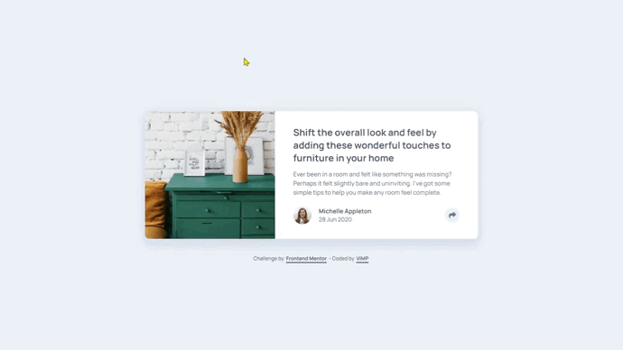

# Frontend Mentor - Article preview component solution

This is a solution to the [Article preview component challenge on Frontend Mentor](https://www.frontendmentor.io/challenges/article-preview-component-dYBN_pYFT).
Frontend Mentor challenges help you improve your coding skills by building realistic projects.

🔳 [The challenge](#the-challenge-nerd_face)

🔳 [Screenshots](#screenshots-camera)

🔳 [Links](#links-link)

🔳 [Built with](#built-with-hammer_and_pich)

🔳 [Author](#author-beginner)

## *The challenge* :nerd_face:

Users should be able to:

🎯 View the optimal layout for the component depending on their device's screen size.

🎯 See the social media share links when they click the share icon.

## *Screenshots* :camera:

## *Links* :link:

[Live Site URL here](https://mendezpvi.github.io/fm-article-preview-component/) 👀

[Solution in Frontend Mentor](https://www.frontendmentor.io/solutions/article-preview-component-bpYp1DoWF3) 👀

[Challenges overcome](https://github.com/mendezpvi/frontend-mentor-challenges) 👀

## *Built with* :hammer_and_pich:

✅ Semantic HTML5 markup

✅ CSS nesting

✅ CSS custom properties

✅ Utility classes

✅ Flexbox

✅ CSS Grid

✅ Vanilla JavaScript

✅ Mobile-first workflow

## *Author* :beginner:

✨ Frontend Mentor - [@mendezpvi](https://www.frontendmentor.io/profile/mendezpvi)
